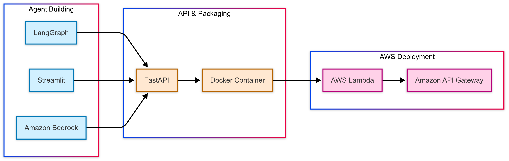

::: {.hero-section}
::: {.hero-content}
# {.hero-title}
Isfar Baset

::: {.hero-subtitle}
Data Analyst
:::

::: {.hero-description}
Crafting AI solutions that bridge the gap between research and real-world impact. 
Specializing in machine learning, data visualization, and conversational AI systems.
:::

::: {.hero-buttons}
[View Projects](#projects){.btn .btn-primary .animated-btn}
[About Me](about-me.html){.btn .btn-outline .animated-btn}
[Chat with Isfar](about-me-chatbot.html){.btn .btn-chat .animated-btn}
:::
:::

::: {.hero-image}
{.profile-image}
:::
:::

::: {#projects .projects-section}
# Featured Projects {.section-title}

::: {.project-grid}

::: {.project-card}
::: {.project-image}

[FMBench Assistant](https://medium.com/@isfarbaset/fmbench-assistant-an-ai-chatbot-for-navigating-foundation-model-benchmarking-with-fmbench-39615ff08161){.project-title}
:::
::: {.project-content}
A conversational AI assistant for Foundation Model Benchmarking built with Amazon Bedrock, AWS Lambda, and LangGraph. This tool helps users navigate complex benchmarking options through natural dialogue.
:::
:::

::: {.project-card}
::: {.project-image}

[Defying Analytics: What Spotify Reveals About Wicked](wicked.html){.project-title}
:::
::: {.project-content}
Twenty years after its Broadway debut, Wicked's soundtrack still dominates Spotify. I analyzed real streaming data from all 28 tracks to figure out what makes certain songs succeed. Turns out everything the music industry tells you about hit songs is backwards.

**Tech Stack:** Python • Spotify API • Plotly • Scikit-learn • SciPy • Quarto  
**Key Finding:** Song length has zero impact on popularity, and the quiet emotional moments beat the showstoppers
:::
:::

::: {.project-card}
::: {.project-image}

[US Insights](https://isfarbaset.github.io/fall-2024-project-team-29/){.project-title}
:::
::: {.project-content}
Analyzing sentiment patterns across U.S. states based on Reddit conversations. Discover what different states are talking about and how those discussions vary in emotional tone.
:::
:::

::: {.project-card}
::: {.project-image}

[Temp Talk](https://isfarbaset.georgetown.domains/story-project/_site/){.project-title}
:::
::: {.project-content}
Exploring climate trends in Southeastern Utah National Parks and their impacts on delicate ecosystems. Analysis of heat, soil conditions, evaporation and precipitation patterns affecting the region.
:::
:::

::: {.project-card}
::: {.project-image}

[Beats and Bytes](Group37_final_Report.html){.project-title}
:::
::: {.project-content}
Exploring the intersection of music and machine learning. Discover patterns in popular music through data analysis, visualizations, and predictive models.
:::
:::

::: {.project-card}
::: {.project-image}

[EV Insights](https://isfarbaset.github.io/ev-insights/){.project-title}
:::
::: {.project-content}
Examining EVs' environmental impact, market share, and performance compared to gasoline vehicles. This analysis uses multiple data science techniques including Naïve Bayes classification, dimensionality reduction, clustering, decision trees and ARM to extract meaningful insights.
:::
:::

::: {.project-card}
::: {.project-image}

[Air Quality Intelligence](aqi.html){.project-title}
:::
::: {.project-content}
A Gen AI conversational agent for real-time air quality monitoring and personalized health recommendations. Ask natural language questions about air quality in any city and receive AI-powered advice tailored to your health conditions.

**Tech Stack:** Python • OpenAI GPT-4 • MCP • Async/Await • API Ninjas  
**Key Feature:** Natural language understanding with context-aware health recommendations for activities like jogging, cycling, and travel planning
:::
:::

:::
:::

<footer style="text-align: center; margin-top: 2rem; padding: 1rem; border-top: 1px solid #ddd; color: #666; font-size: 0.9rem;">
Portfolio curated by Isfar Baset
</footer>