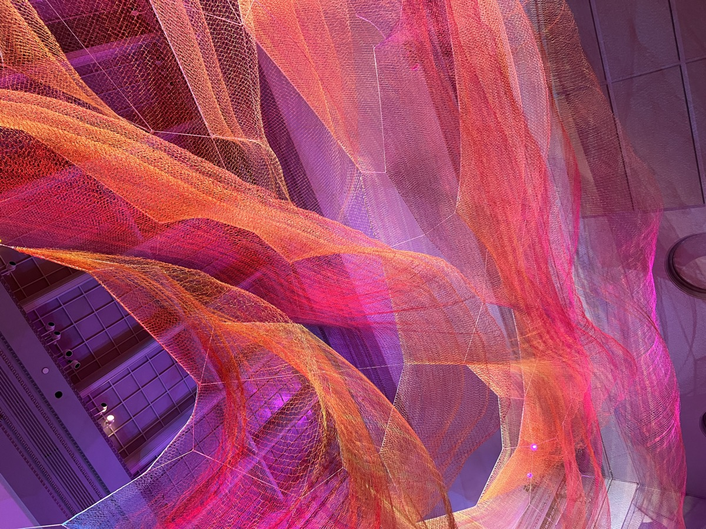
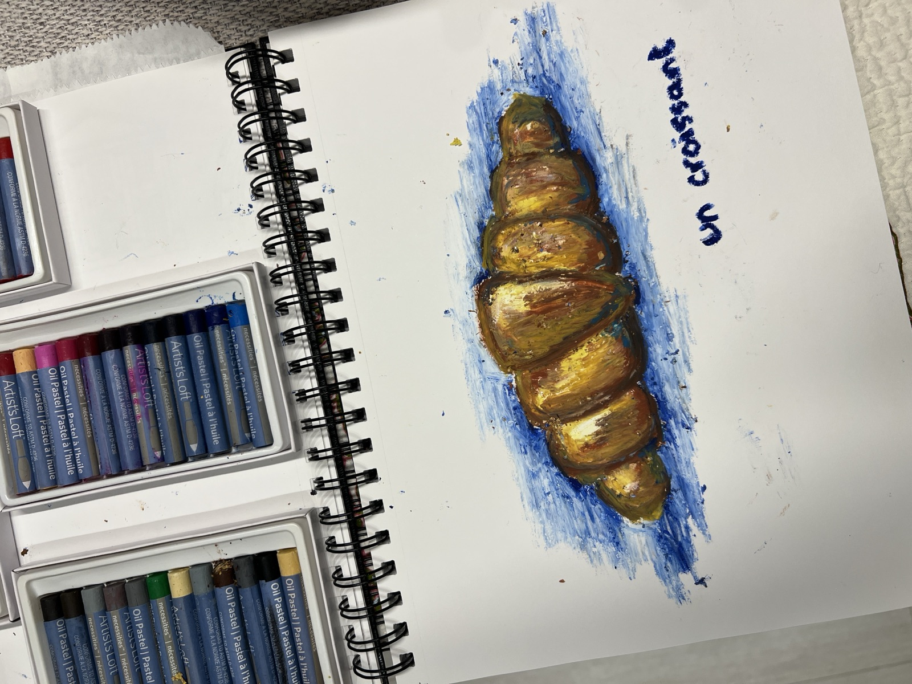
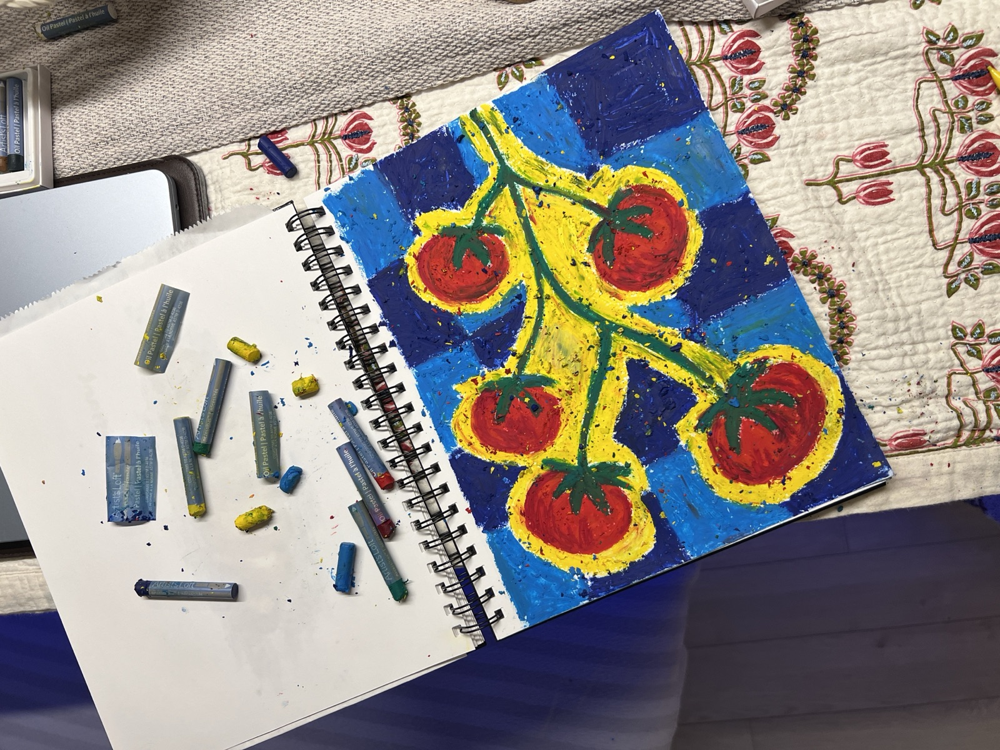
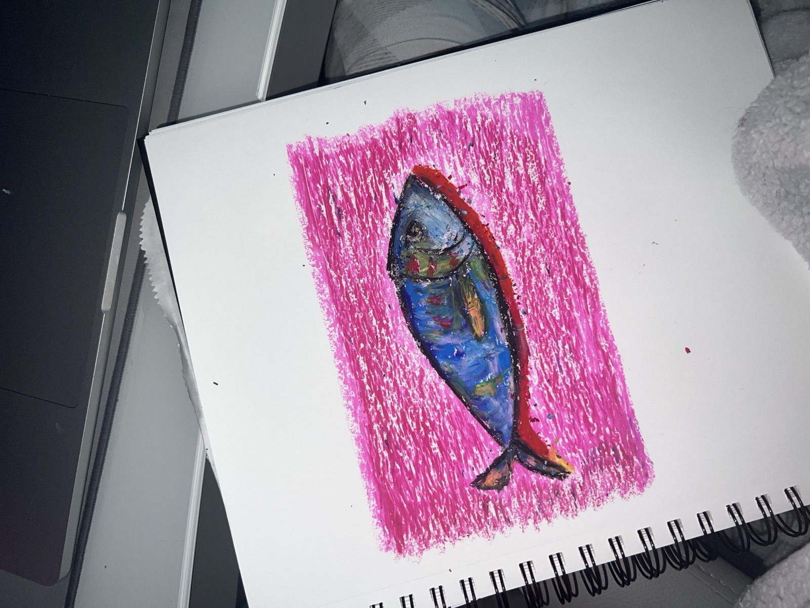
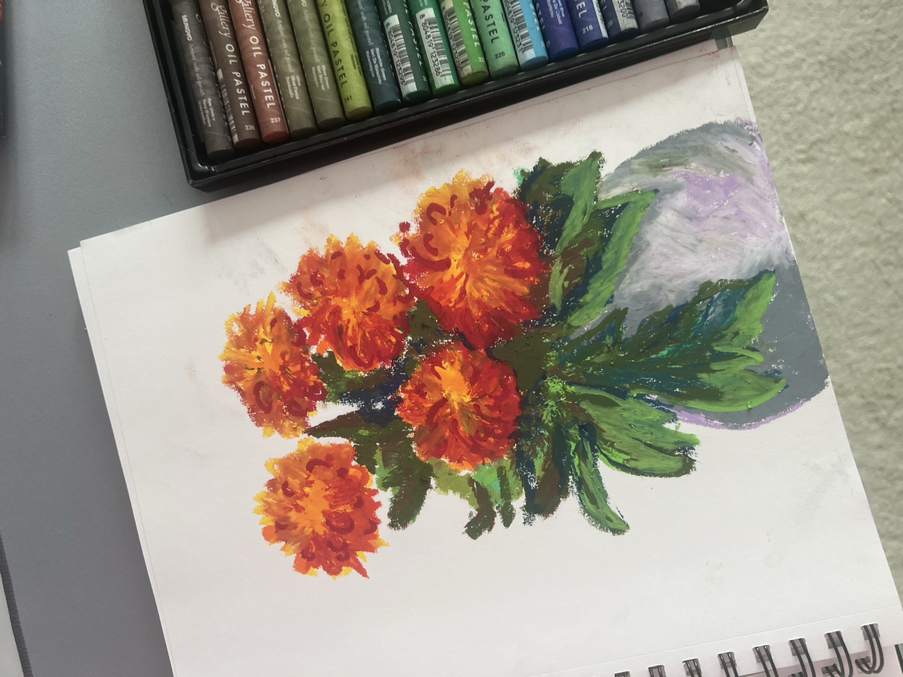
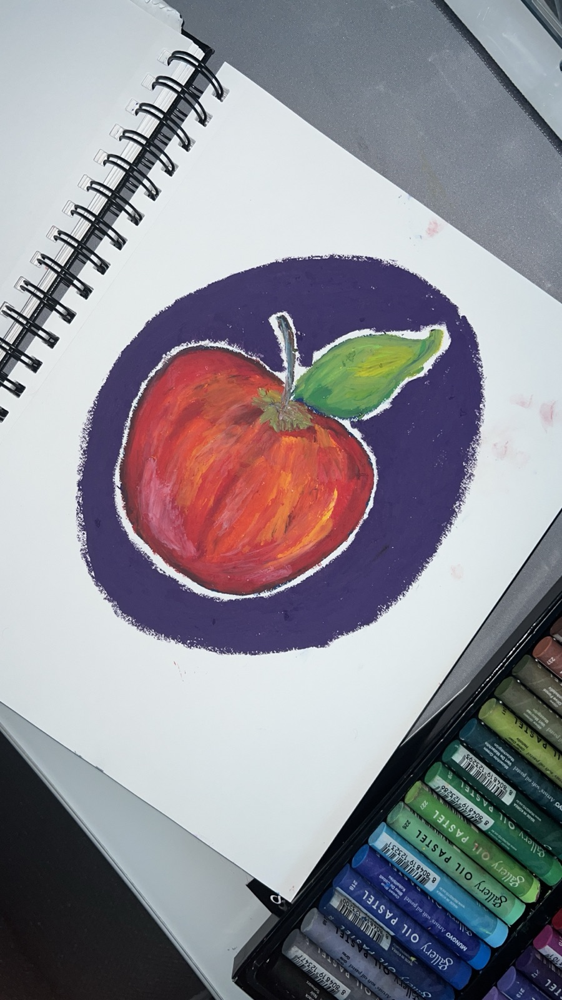
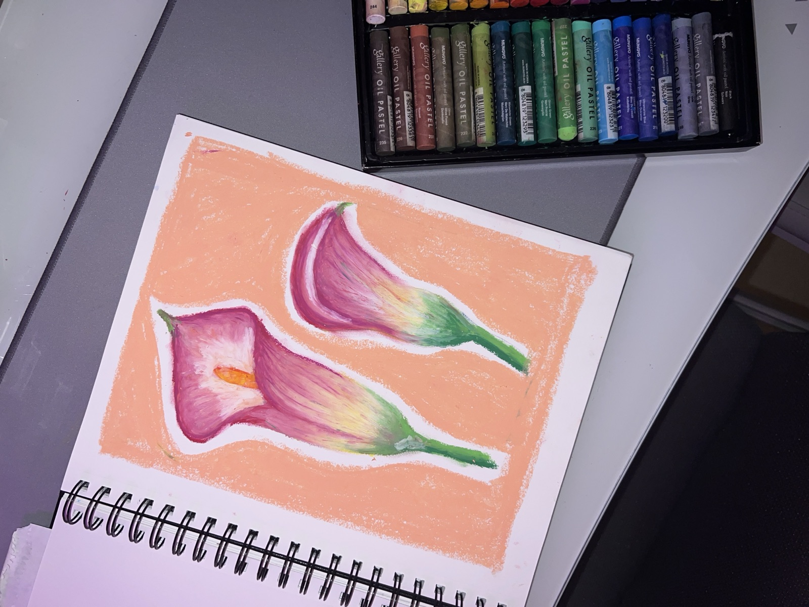
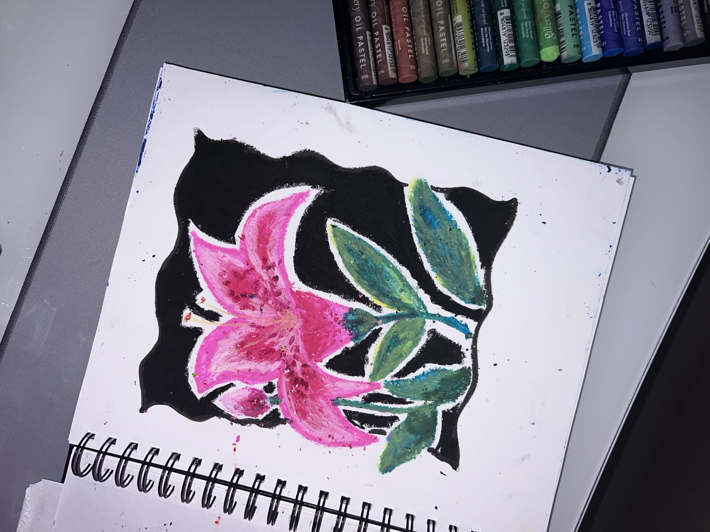

::: {.hero-section}
::: {.hero-content}
# {.hero-title}
Isfar Baset

::: {.hero-subtitle}
<span class="animated-text">Data Analyst</span>
:::

::: {.hero-description}
Crafting AI solutions that bridge the gap between research and real-world impact. 
Specializing in machine learning, data visualization, and conversational AI systems.
:::

::: {.hero-buttons}
[View Projects](#projects){.btn .btn-primary .animated-btn}
[About Me](about-me.html){.btn .btn-outline .animated-btn}
:::
:::

::: {.hero-image}
{.profile-image}
:::
:::

::: {#projects .projects-section}
# Featured Projects {.section-title}

::: {.projects-carousel-wrap}
::: {.project-grid}

::: {.project-card}
::: {.project-image}

:::
::: {.project-content}
### [Almanac](https://isfarbaset.github.io/almanac/)
A private, local-only menstrual tracker. No accounts, no servers, no ads — period data stays in your browser via IndexedDB. Built after watching Flo get fined by the FTC for handing health data to Facebook.

**Tech Stack:** React • IndexedDB • PWA • Vite  
**Key Feature:** Weighted next-period prediction with a confidence window instead of a fake-precise single date
:::
:::

::: {.project-card}
::: {.project-image}

:::
::: {.project-content}
### [DMV Blooms](https://isfarbaset.github.io/dmv-blooms/)
A seasonal field guide to flowers across DC, Maryland, and Virginia. Find what's peaking right now and where to chase it — cherry blossoms, bluebells, lotus, lavender, and nine more, mapped across 28 spots.

**Tech Stack:** JavaScript • Interactive Map • Quarto • CSS  
**Key Feature:** Weekend picks driven by live bloom status, plus a full-year calendar for planning ahead
:::
:::

::: {.project-card}
::: {.project-image}
_JELLY_LUISE_Photos_ID10196.jpg)
:::
::: {.project-content}
### [FMBench Assistant](https://medium.com/@isfarbaset/fmbench-assistant-an-ai-chatbot-for-navigating-foundation-model-benchmarking-with-fmbench-39615ff08161)
A conversational AI assistant for Foundation Model Benchmarking built with Amazon Bedrock, AWS Lambda, and LangGraph. This tool helps users navigate complex benchmarking options through natural dialogue.
:::
:::

::: {.project-card}
::: {.project-image}

:::
::: {.project-content}
### [Netflix Recap](https://isfarbaset.github.io/netflix-recap/)
A personalized Netflix viewing analytics dashboard that transforms your watch history into beautiful insights. Discover your viewing patterns, favorite genres, binge-watching habits, and more through interactive visualizations.

**Tech Stack:** Python • Data Visualization • Pandas • Interactive Dashboard
:::
:::

::: {.project-card}
::: {.project-image}

:::
::: {.project-content}
### [GitHub Insights](https://isfarbaset.github.io/github-insights/)
Generate your own GitHub stats card. Enter any username and get a downloadable PNG with lifetime stats, streaks, top repos, coding activity breakdowns, developer personality badges, and more — ready to share on LinkedIn or add to your portfolio.

**Tech Stack:** JavaScript • CSS • GitHub API • HTML Canvas • Quarto
:::
:::

::: {.project-card}
::: {.project-image}

:::
::: {.project-content}
### [Defying Analytics: What Spotify Reveals About Wicked](wicked.html)
Twenty years after its Broadway debut, Wicked's soundtrack still dominates Spotify. I analyzed real streaming data from all 28 tracks to figure out what makes certain songs succeed. Turns out everything the music industry tells you about hit songs is backwards.

**Tech Stack:** Python • Spotify API • Plotly • Scikit-learn • SciPy • Quarto  
**Key Finding:** Song length has zero impact on popularity, and the quiet emotional moments beat the showstoppers
:::
:::

::: {.project-card}
::: {.project-image}

:::
::: {.project-content}
### [US Insights](https://isfarbaset.github.io/fall-2024-project-team-29/)
Analyzing sentiment patterns across U.S. states based on Reddit conversations. Discover what different states are talking about and how those discussions vary in emotional tone.
:::
:::

::: {.project-card}
::: {.project-image}

:::
::: {.project-content}
### [Temp Talk](https://isfarbaset.github.io/story-project/)
Exploring climate trends in Southeastern Utah National Parks and their impacts on delicate ecosystems. Analysis of heat, soil conditions, evaporation and precipitation patterns affecting the region.
:::
:::

::: {.project-card}
::: {.project-image}

:::
::: {.project-content}
### [Beats and Bytes](Group37_final_Report.html)
Exploring the intersection of music and machine learning. Discover patterns in popular music through data analysis, visualizations, and predictive models.
:::
:::

::: {.project-card}
::: {.project-image}

:::
::: {.project-content}
### [EV Insights](https://isfarbaset.github.io/ev-insights/)
Examining EVs' environmental impact, market share, and performance compared to gasoline vehicles. This analysis uses multiple data science techniques including Naïve Bayes classification, dimensionality reduction, clustering, decision trees and ARM to extract meaningful insights.
:::
:::

::: {.project-card}
::: {.project-image}
_Madeline_Spanier_Photos_ID5261.jpg)
:::
::: {.project-content}
### [Air Quality Intelligence](aqi.html)
A Gen AI conversational agent for real-time air quality monitoring and personalized health recommendations. Ask natural language questions about air quality in any city and receive AI-powered advice tailored to your health conditions.

**Tech Stack:** Python • OpenAI GPT-4 • MCP • Async/Await • API Ninjas  
**Key Feature:** Natural language understanding with context-aware health recommendations for activities like jogging, cycling, and travel planning
:::
:::

:::
:::
:::

::: {#hobbies .hobbies-section}
# Beyond the Data {.section-title}

::: {.hobbies-intro}
When I close the laptop, this is where I end up. A few things I make time for that have nothing to do with a query or a dashboard.
:::

```{=html}
<div class="hobbies-grid hobbies-grid-4">
  <div class="hobby-item">
    <span class="hobby-icon">🎨</span>
    <p><strong>Oil Pastels</strong><br>
    Food, flowers, and the occasional fish. It started as a way to unwind and turned into a small obsession. Gallery is right below.</p>
  </div>
  <div class="hobby-item">
    <span class="hobby-icon">📚</span>
    <p><strong>Reading</strong><br>
    Usually two books deep at once. Fiction to unwind, nonfiction to feel productive about unwinding.</p>
  </div>
  <div class="hobby-item">
    <span class="hobby-icon">🎾</span>
    <p><strong>Tennis</strong><br>
    Picked it up this year. Still losing to people who started last month, but my forehand and I are working on it.</p>
  </div>
  <a class="hobby-item hobby-item-link" href="https://www.instagram.com/is.far/" target="_blank" rel="noopener">
    <span class="hobby-icon">📷</span>
    <p><strong>Photography</strong><br>
    I take way too many photos. The ones worth keeping end up on Instagram.</p>
  </a>
</div>
```

::: {.art-block}
## The Oil Pastel Gallery {.subsection-title}

::: {.art-lede}
No grand plan here, just me, a sketchbook, and a box of oil pastels. Mostly still lifes: fruit, flowers, and one very smug fish. Click any piece to see it up close.
:::

```{=html}
<div class="art-gallery">
  <figure class="art-tile" tabindex="0" role="button" aria-label="View: Un Croissant" data-full="images/art/croissant.jpg" data-caption="Un Croissant &middot; oil pastel">
    
    <figcaption>Un Croissant</figcaption>
  </figure>
  <figure class="art-tile" tabindex="0" role="button" aria-label="View: Tomatoes on the Vine" data-full="images/art/tomatoes.jpg" data-caption="Tomatoes on the Vine &middot; oil pastel">
    
    <figcaption>Tomatoes on the Vine</figcaption>
  </figure>
  <figure class="art-tile" tabindex="0" role="button" aria-label="View: One Fish" data-full="images/art/fish.jpg" data-caption="One Fish &middot; oil pastel">
    
    <figcaption>One Fish</figcaption>
  </figure>
  <figure class="art-tile" tabindex="0" role="button" aria-label="View: Marigolds" data-full="images/art/marigolds.jpg" data-caption="Marigolds &middot; oil pastel">
    
    <figcaption>Marigolds</figcaption>
  </figure>
  <figure class="art-tile" tabindex="0" role="button" aria-label="View: One Apple" data-full="images/art/apple.jpg" data-caption="One Apple &middot; oil pastel">
    
    <figcaption>One Apple</figcaption>
  </figure>
  <figure class="art-tile" tabindex="0" role="button" aria-label="View: Calla Lilies" data-full="images/art/calla-lilies.jpg" data-caption="Calla Lilies &middot; oil pastel">
    
    <figcaption>Calla Lilies</figcaption>
  </figure>
  <figure class="art-tile" tabindex="0" role="button" aria-label="View: Pink Lily" data-full="images/art/lily.jpg" data-caption="Pink Lily &middot; oil pastel">
    
    <figcaption>Pink Lily</figcaption>
  </figure>
</div>

<div class="art-lightbox" id="artLightbox" role="dialog" aria-modal="true" aria-hidden="true">
  <button class="art-lightbox-close" aria-label="Close">&times;</button>
  <figure class="art-lightbox-inner">
    
    <figcaption></figcaption>
  </figure>
</div>
```
:::
:::

<script>
document.addEventListener('DOMContentLoaded', function() {
    const roles = [
        'Data Analyst',
        'Data Scientist', 
        'Data Engineer',
        'Machine Learning Engineer',
        'Software Engineer'
    ];
    
    const animatedText = document.querySelector('.animated-text');
    let currentIndex = 0;
    
    function changeText() {
        // Fade out current text
        animatedText.classList.add('text-fade-out');
        
        setTimeout(() => {
            // Change text and fade in
            currentIndex = (currentIndex + 1) % roles.length;
            animatedText.textContent = roles[currentIndex];
            animatedText.classList.remove('text-fade-out');
            animatedText.classList.add('text-fade-in');
            
            setTimeout(() => {
                animatedText.classList.remove('text-fade-in');
            }, 500);
        }, 500);
    }
    
    // Change text every 2 seconds
    setInterval(changeText, 2000);

    // Projects carousel
    const wrap = document.querySelector('.projects-carousel-wrap');
    const grid = wrap && wrap.querySelector('.project-grid');
    if (wrap && grid) {
        const prev = document.createElement('button');
        prev.className = 'carousel-btn carousel-prev';
        prev.setAttribute('aria-label', 'Previous projects');
        prev.innerHTML = '‹';

        const next = document.createElement('button');
        next.className = 'carousel-btn carousel-next';
        next.setAttribute('aria-label', 'Next projects');
        next.innerHTML = '›';

        wrap.appendChild(prev);
        wrap.appendChild(next);

        const stepBy = () => {
            const card = grid.querySelector('.project-card');
            const gap = parseFloat(getComputedStyle(grid).columnGap || getComputedStyle(grid).gap || 32) || 32;
            return card ? card.offsetWidth + gap : 400;
        };

        prev.addEventListener('click', () => grid.scrollBy({ left: -stepBy(), behavior: 'smooth' }));
        next.addEventListener('click', () => grid.scrollBy({ left: stepBy(), behavior: 'smooth' }));

        const updateButtons = () => {
            prev.disabled = grid.scrollLeft <= 2;
            next.disabled = grid.scrollLeft + grid.clientWidth >= grid.scrollWidth - 2;
        };

        grid.addEventListener('scroll', updateButtons);
        window.addEventListener('resize', updateButtons);
        updateButtons();
    }

    // Art gallery lightbox
    const lightbox = document.getElementById('artLightbox');
    if (lightbox) {
        const lbImg = lightbox.querySelector('img');
        const lbCap = lightbox.querySelector('figcaption');
        const closeBtn = lightbox.querySelector('.art-lightbox-close');

        const openLightbox = (tile) => {
            const img = tile.querySelector('img');
            lbImg.src = tile.getAttribute('data-full') || (img && img.src) || '';
            lbImg.alt = (img && img.alt) || '';
            lbCap.innerHTML = tile.getAttribute('data-caption') || '';
            lightbox.classList.add('is-open');
            lightbox.setAttribute('aria-hidden', 'false');
            document.body.style.overflow = 'hidden';
        };

        const closeLightbox = () => {
            lightbox.classList.remove('is-open');
            lightbox.setAttribute('aria-hidden', 'true');
            document.body.style.overflow = '';
            lbImg.src = '';
        };

        document.querySelectorAll('.art-tile').forEach((tile) => {
            tile.addEventListener('click', () => openLightbox(tile));
            tile.addEventListener('keydown', (e) => {
                if (e.key === 'Enter' || e.key === ' ') {
                    e.preventDefault();
                    openLightbox(tile);
                }
            });
        });

        closeBtn.addEventListener('click', closeLightbox);
        lightbox.addEventListener('click', (e) => {
            if (e.target === lightbox) closeLightbox();
        });
        document.addEventListener('keydown', (e) => {
            if (e.key === 'Escape' && lightbox.classList.contains('is-open')) closeLightbox();
        });
    }
});
</script>

<footer style="text-align: center; margin-top: 2rem; padding: 1rem; border-top: 1px solid #ddd; color: #666; font-size: 0.9rem;">
Portfolio curated by Isfar Baset
</footer>